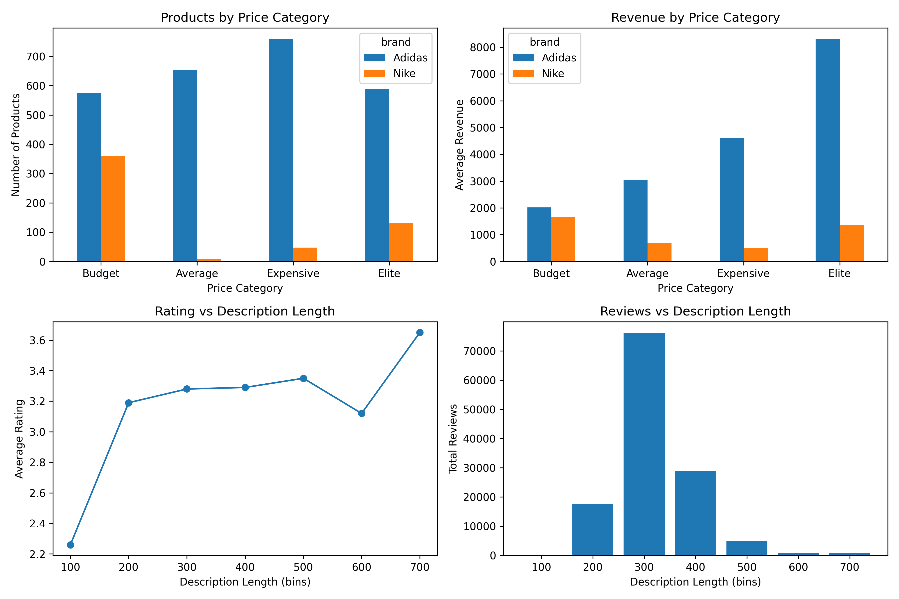

# 🛍️ Product Revenue Analytics Using Python
### Data-Driven Insights for an Online Sportswear Retailer

This project analyzes how an online sportswear retailer can optimize product revenue by leveraging product attributes, pricing strategies, customer engagement, and brand performance.

Using Python and data visualization tools, the analysis uncovers actionable insights to support **pricing decisions, product positioning, and marketing strategies**.

---

## 📊 Project Overview

The analysis focuses on answering the following key questions:

- How do product pricing categories relate to revenue?
- How do Adidas and Nike compare across product tiers?
- How does product description length influence ratings and reviews?
- Which product lines generate the highest revenue?
- How does revenue evolve across months and warehouses?

---

## 🧠 Key Business Insights

### 🏷️ Brand & Pricing Performance
- Adidas offers a wider range of products across all price tiers.
- Adidas generates higher average revenue in every category, especially in the **Elite tier**.
- Nike’s limited presence in premium categories restricts its revenue potential.

### ✍️ Product Description Impact
- Longer descriptions (~700 characters) are associated with higher customer ratings.
- Medium-length descriptions (~300 characters) generate the highest number of reviews.
- This suggests two optimization strategies:
  - Longer descriptions → higher customer satisfaction  
  - Medium descriptions → higher engagement  

### 💰 Revenue by Product Line
- Certain product lines consistently outperform others in both total and average revenue.
- These lines should be prioritized for:
  - Inventory planning  
  - Marketing campaigns  
  - Promotional strategies  

### 🗓️ Seasonal & Operational Trends
- Monthly revenue patterns show clear seasonal spikes, likely tied to sports seasons and holidays.
- Warehouse-level revenue distribution is uneven, indicating opportunities for logistics optimization.

---

## 📈 Results Summary

- Premium product tiers (**Elite** and **Expensive**) generate the highest revenue.
- Adidas outperforms Nike across all pricing categories.
- Product description length significantly impacts both **ratings and engagement**.
- Revenue performance varies across product lines and time, highlighting opportunities for **data-driven decision-making**.

---

## 📊 Dashboard Overview

---

## 🛠️ Tech Stack

- Python  
- Pandas  
- Matplotlib  
- Seaborn  
- Jupyter Notebook / VS Code  
- Git & GitHub  

---

